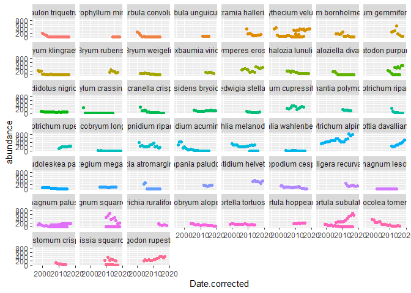

Week4_homework
================

## Last week’s Code

``` r
##load vroom
library(vroom)
##load tidyverse
library("tidyverse")
```

    ## Registered S3 methods overwritten by 'readr':
    ##   method                    from 
    ##   as.data.frame.spec_tbl_df vroom
    ##   as_tibble.spec_tbl_df     vroom
    ##   format.col_spec           vroom
    ##   print.col_spec            vroom
    ##   print.collector           vroom
    ##   print.date_names          vroom
    ##   print.locale              vroom
    ##   str.col_spec              vroom

    ## -- Attaching packages --------------------------------------- tidyverse 1.3.1 --

    ## v ggplot2 3.3.5     v purrr   0.3.4
    ## v tibble  3.1.5     v dplyr   1.0.7
    ## v tidyr   1.1.4     v stringr 1.4.0
    ## v readr   2.0.2     v forcats 0.5.1

    ## -- Conflicts ------------------------------------------ tidyverse_conflicts() --
    ## x readr::col_character()  masks vroom::col_character()
    ## x readr::col_date()       masks vroom::col_date()
    ## x readr::col_datetime()   masks vroom::col_datetime()
    ## x readr::col_double()     masks vroom::col_double()
    ## x readr::col_factor()     masks vroom::col_factor()
    ## x readr::col_guess()      masks vroom::col_guess()
    ## x readr::col_integer()    masks vroom::col_integer()
    ## x readr::col_logical()    masks vroom::col_logical()
    ## x readr::col_number()     masks vroom::col_number()
    ## x readr::col_skip()       masks vroom::col_skip()
    ## x readr::col_time()       masks vroom::col_time()
    ## x readr::cols()           masks vroom::cols()
    ## x readr::default_locale() masks vroom::default_locale()
    ## x dplyr::filter()         masks stats::filter()
    ## x readr::fwf_cols()       masks vroom::fwf_cols()
    ## x readr::fwf_empty()      masks vroom::fwf_empty()
    ## x readr::fwf_positions()  masks vroom::fwf_positions()
    ## x readr::fwf_widths()     masks vroom::fwf_widths()
    ## x dplyr::lag()            masks stats::lag()
    ## x readr::locale()         masks vroom::locale()
    ## x readr::output_column()  masks vroom::output_column()
    ## x readr::problems()       masks vroom::problems()

``` r
##read in the data
wide_spp.1 <- vroom("https://raw.githubusercontent.com/chrit88/Bioinformatics_data/master/Workshop%203/to_sort_pop_1.csv")
```

    ## Rows: 30 Columns: 29

    ## -- Column specification --------------------------------------------------------
    ## Delimiter: "\t"
    ## chr  (4): species, primary_threat, secondary_threat, tertiary_threat
    ## dbl (24): pop_1_2003-01-01, pop_1_2004-01-01, pop_1_2005-01-01, pop_1_2006-0...
    ## lgl  (1): pop_1_1995-01-01

    ## 
    ## i Use `spec()` to retrieve the full column specification for this data.
    ## i Specify the column types or set `show_col_types = FALSE` to quiet this message.

``` r
wide_spp.2 <- vroom("https://raw.githubusercontent.com/chrit88/Bioinformatics_data/master/Workshop%203/to_sort_pop_2.csv") 
```

    ## Rows: 30 Columns: 28

    ## -- Column specification --------------------------------------------------------
    ## Delimiter: "\t"
    ## chr  (4): species, primary_threat, secondary_threat, tertiary_threat
    ## dbl (21): pop_2_2000-01-01, pop_2_2001-01-01, pop_2_2002-01-01, pop_2_2003-0...
    ## lgl  (3): pop_2_1996-01-01, pop_2_1997-01-01, pop_2_1998-01-01

    ## 
    ## i Use `spec()` to retrieve the full column specification for this data.
    ## i Specify the column types or set `show_col_types = FALSE` to quiet this message.

``` r
## code to reshape data
## first join the data using full join - this will keep all of the columns
long_spp <- full_join(wide_spp.1, wide_spp.2) %>%
  ## pivot the joined data frame, using species, primary_threat, secondary_threat, tertiary_threat as ID columns
  ## and using names-pattern to pull out the population number 
  ## and make a new column (called population) to store them in. 
  ##Drop the NAs. 
  pivot_longer(cols = -c(species, 
                         primary_threat, 
                         secondary_threat, 
                         tertiary_threat), 
               names_to = c("population", "date"),
               names_pattern = "(.*)_(.*)",
               values_drop_na = F, 
               values_to = "abundance")
```

    ## Joining, by = c("species", "primary_threat", "secondary_threat", "tertiary_threat")

## This week’s work

``` r
library(lubridate)
```

    ## 
    ## Attaching package: 'lubridate'

    ## The following objects are masked from 'package:base':
    ## 
    ##     date, intersect, setdiff, union

``` r
long_spp$Date.corrected <- as_date(long_spp$date)
long_spp
```

    ## # A tibble: 2,940 x 8
    ##    species    primary_threat  secondary_threat tertiary_threat population date  
    ##    <chr>      <chr>           <chr>            <chr>           <chr>      <chr> 
    ##  1 Schistidi~ Habitat destru~ <NA>             <NA>            pop_1      2003-~
    ##  2 Schistidi~ Habitat destru~ <NA>             <NA>            pop_1      2004-~
    ##  3 Schistidi~ Habitat destru~ <NA>             <NA>            pop_1      2005-~
    ##  4 Schistidi~ Habitat destru~ <NA>             <NA>            pop_1      2006-~
    ##  5 Schistidi~ Habitat destru~ <NA>             <NA>            pop_1      2007-~
    ##  6 Schistidi~ Habitat destru~ <NA>             <NA>            pop_1      2008-~
    ##  7 Schistidi~ Habitat destru~ <NA>             <NA>            pop_1      2009-~
    ##  8 Schistidi~ Habitat destru~ <NA>             <NA>            pop_1      2010-~
    ##  9 Schistidi~ Habitat destru~ <NA>             <NA>            pop_1      2011-~
    ## 10 Schistidi~ Habitat destru~ <NA>             <NA>            pop_1      2012-~
    ## # ... with 2,930 more rows, and 2 more variables: abundance <dbl>,
    ## #   Date.corrected <date>

``` r
ggplot(data = long_spp, aes(x = Date.corrected, y = abundance)) +
  geom_point(aes(col = species)) +
  theme(legend.position = "none") +
  facet_wrap(. ~ species)
```

    ## Warning: Removed 2244 rows containing missing values (geom_point).

<!-- -->
