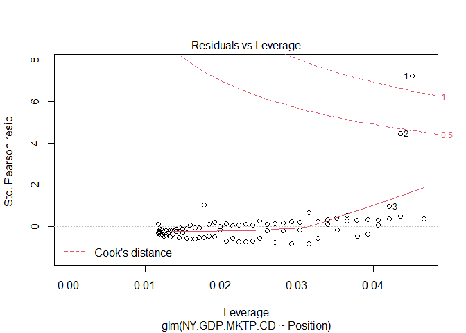
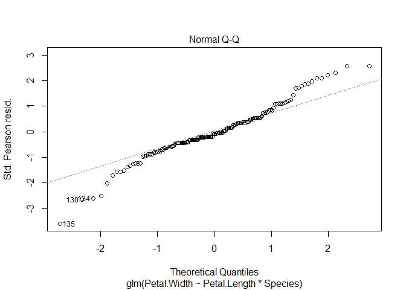

Homework Week6
================
Hanyu Zhao

## Part 1 - Tokyo Olymics

``` r
##load vroom
library(vroom)
##use vroom to read in medal table data from github:
tokyo_medal_list <- vroom("https://raw.githubusercontent.com/chrit88/Bioinformatics_data/master/Workshop%205/Tokyo%202021%20medals.csv")
```

    ## Rows: 89 Columns: 4

    ## -- Column specification --------------------------------------------------------
    ## Delimiter: ","
    ## chr (1): Country
    ## dbl (3): Gold, Silver, Bronze

    ## 
    ## i Use `spec()` to retrieve the full column specification for this data.
    ## i Specify the column types or set `show_col_types = FALSE` to quiet this message.

``` r
##load tidyverse
library(tidyverse)
```

    ## Registered S3 methods overwritten by 'readr':
    ##   method                    from 
    ##   as.data.frame.spec_tbl_df vroom
    ##   as_tibble.spec_tbl_df     vroom
    ##   format.col_spec           vroom
    ##   print.col_spec            vroom
    ##   print.collector           vroom
    ##   print.date_names          vroom
    ##   print.locale              vroom
    ##   str.col_spec              vroom

    ## -- Attaching packages --------------------------------------- tidyverse 1.3.1 --

    ## v ggplot2 3.3.5     v purrr   0.3.4
    ## v tibble  3.1.5     v dplyr   1.0.7
    ## v tidyr   1.1.4     v stringr 1.4.0
    ## v readr   2.0.2     v forcats 0.5.1

    ## -- Conflicts ------------------------------------------ tidyverse_conflicts() --
    ## x readr::col_character()  masks vroom::col_character()
    ## x readr::col_date()       masks vroom::col_date()
    ## x readr::col_datetime()   masks vroom::col_datetime()
    ## x readr::col_double()     masks vroom::col_double()
    ## x readr::col_factor()     masks vroom::col_factor()
    ## x readr::col_guess()      masks vroom::col_guess()
    ## x readr::col_integer()    masks vroom::col_integer()
    ## x readr::col_logical()    masks vroom::col_logical()
    ## x readr::col_number()     masks vroom::col_number()
    ## x readr::col_skip()       masks vroom::col_skip()
    ## x readr::col_time()       masks vroom::col_time()
    ## x readr::cols()           masks vroom::cols()
    ## x readr::default_locale() masks vroom::default_locale()
    ## x dplyr::filter()         masks stats::filter()
    ## x readr::fwf_cols()       masks vroom::fwf_cols()
    ## x readr::fwf_empty()      masks vroom::fwf_empty()
    ## x readr::fwf_positions()  masks vroom::fwf_positions()
    ## x readr::fwf_widths()     masks vroom::fwf_widths()
    ## x dplyr::lag()            masks stats::lag()
    ## x readr::locale()         masks vroom::locale()
    ## x readr::output_column()  masks vroom::output_column()
    ## x readr::problems()       masks vroom::problems()

``` r
##load wbstats
library(wbstats)
##get GDP data
GDP <- wb_data(indicator = "NY.GDP.MKTP.CD",
               start_date = 2019,
               end_date = 2019)
##load country code
library(countrycode)
##add country code to tokyo medal table
tokyo_medal_list$iso3c <- countrycode(tokyo_medal_list$Country,
                                            origin = "country.name",
                                            destination = "iso3c")
```

    ## Warning in countrycode_convert(sourcevar = sourcevar, origin = origin, destination = dest, : Some values were not matched unambiguously: Kosovo

``` r
##correct China
tokyo_medal_list$iso3c[2] <- "CHN"
##add Position to tokyo medal table
tokyo_medal_list$Position <- 1:length(tokyo_medal_list$Country)
##merge the GDP data into the medal table
tokyo_medal_list <- left_join(tokyo_medal_list, GDP, by = "iso3c")

##visualise the relation between GDP and position in the table
p1 <- ggplot(tokyo_medal_list, aes(x=NY.GDP.MKTP.CD, y=Position))+
  geom_point()+
  theme_bw()
p1
```

    ## Warning: Removed 4 rows containing missing values (geom_point).

<!-- -->

``` r
##try to fit a glm
mod1 <- glm(NY.GDP.MKTP.CD ~ Position,
            data = tokyo_medal_list,
            family = gaussian)
plot(mod1)
```

<!-- --><!-- --><!-- --><!-- -->

``` r
##try another one
mod2 <- glm(log10(NY.GDP.MKTP.CD) ~ log10(Position),
            data = tokyo_medal_list)
plot(mod2)
```

<!-- --><!-- --><!-- --><!-- -->

``` r
##mod2 looks better

##re-plot the data
p2 <- ggplot(tokyo_medal_list, aes(x=NY.GDP.MKTP.CD, y=Position))+
  geom_point()+
  theme_bw()+
  scale_x_continuous(trans = "log10")+
  scale_y_continuous(trans = "log10")+
  ggtitle("logged data")
p2
```

    ## Warning: Removed 4 rows containing missing values (geom_point).

<!-- -->

``` r
##look at the summary
summary(mod2)
```

    ## 
    ## Call:
    ## glm(formula = log10(NY.GDP.MKTP.CD) ~ log10(Position), data = tokyo_medal_list)
    ## 
    ## Deviance Residuals: 
    ##      Min        1Q    Median        3Q       Max  
    ## -1.61093  -0.55392   0.07485   0.44512   1.58974  
    ## 
    ## Coefficients:
    ##                 Estimate Std. Error t value Pr(>|t|)    
    ## (Intercept)      13.2751     0.2708  49.013  < 2e-16 ***
    ## log10(Position)  -1.3376     0.1720  -7.775 1.82e-11 ***
    ## ---
    ## Signif. codes:  0 '***' 0.001 '**' 0.01 '*' 0.05 '.' 0.1 ' ' 1
    ## 
    ## (Dispersion parameter for gaussian family taken to be 0.411382)
    ## 
    ##     Null deviance: 59.014  on 84  degrees of freedom
    ## Residual deviance: 34.145  on 83  degrees of freedom
    ##   (4 observations deleted due to missingness)
    ## AIC: 169.7
    ## 
    ## Number of Fisher Scoring iterations: 2

## Part 2 - Iris with multiple predictors

``` r
##load the iris data set
data(iris)

##visualise the data
p3 <- ggplot(iris, aes(x=Petal.Length, y=Petal.Width, col=Species)) +
  geom_point()+
  theme_bw()
p3
```

<!-- -->

``` r
##try to fit a glm
mod3 <- glm(Petal.Width ~ Petal.Length*Species, data = iris)
plot(mod3)
```

<!-- --><!-- --><!-- --><!-- -->

``` r
##try transformation of response variable: log10()
mod4 <- glm(log10(Petal.Width) ~Petal.Length*Species, data = iris)
plot(mod4)
```

<!-- --><!-- --><!-- --><!-- -->

``` r
##looks bad

##try another transformation: sqrt()
mod5 <- glm(sqrt(Petal.Width) ~ Petal.Length*Species, data = iris)
plot(mod5)
```

<!-- --><!-- --><!-- --><!-- -->

``` r
##looks good

##look at the summary
summary(mod5)
```

    ## 
    ## Call:
    ## glm(formula = sqrt(Petal.Width) ~ Petal.Length * Species, data = iris)
    ## 
    ## Deviance Residuals: 
    ##      Min        1Q    Median        3Q       Max  
    ## -0.23961  -0.04583  -0.00825   0.04838   0.26267  
    ## 
    ## Coefficients:
    ##                                Estimate Std. Error t value Pr(>|t|)    
    ## (Intercept)                     0.20974    0.10091   2.079  0.03943 *  
    ## Petal.Length                    0.18887    0.06855   2.755  0.00662 ** 
    ## Speciesversicolor               0.31788    0.14821   2.145  0.03365 *  
    ## Speciesvirginica                0.89496    0.15704   5.699 6.57e-08 ***
    ## Petal.Length:Speciesversicolor -0.04317    0.07308  -0.591  0.55565    
    ## Petal.Length:Speciesvirginica  -0.13206    0.07186  -1.838  0.06816 .  
    ## ---
    ## Signif. codes:  0 '***' 0.001 '**' 0.01 '*' 0.05 '.' 0.1 ' ' 1
    ## 
    ## (Dispersion parameter for gaussian family taken to be 0.006943608)
    ## 
    ##     Null deviance: 24.42219  on 149  degrees of freedom
    ## Residual deviance:  0.99988  on 144  degrees of freedom
    ## AIC: -311.93
    ## 
    ## Number of Fisher Scoring iterations: 2

Conclusion:

the value of intercept is significant(\*)

there is a significant effect of Petal.Length on Petal.width(\*\*)

Petal.width changes between species with a significant effect of
versicolor\* or virginica(\*\*\*)

but Petal.length of different species has no significant effect on
Petal.width
